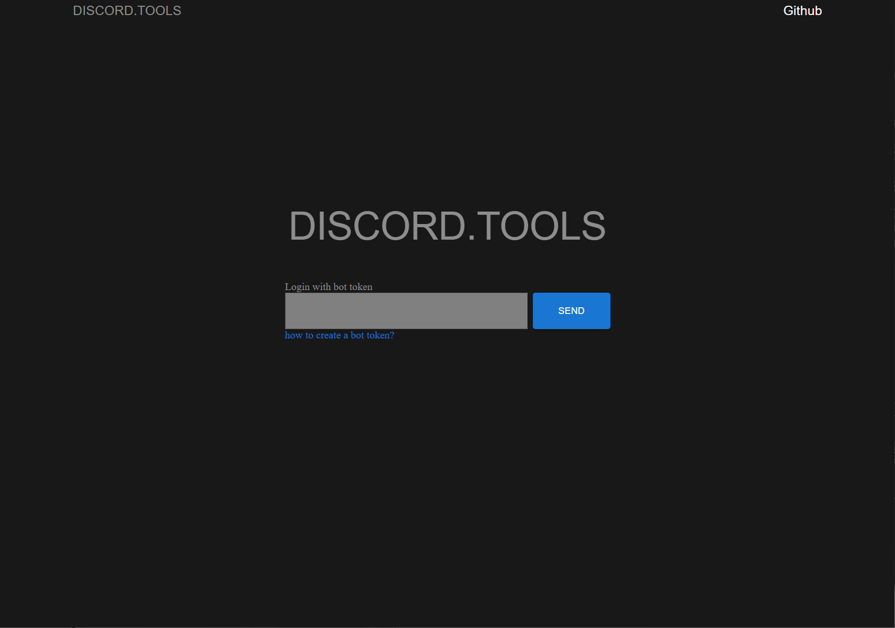
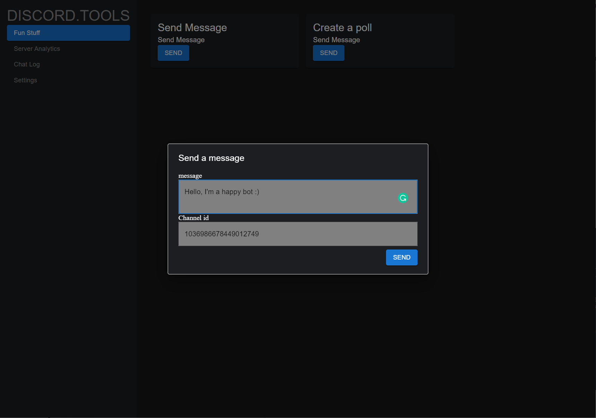
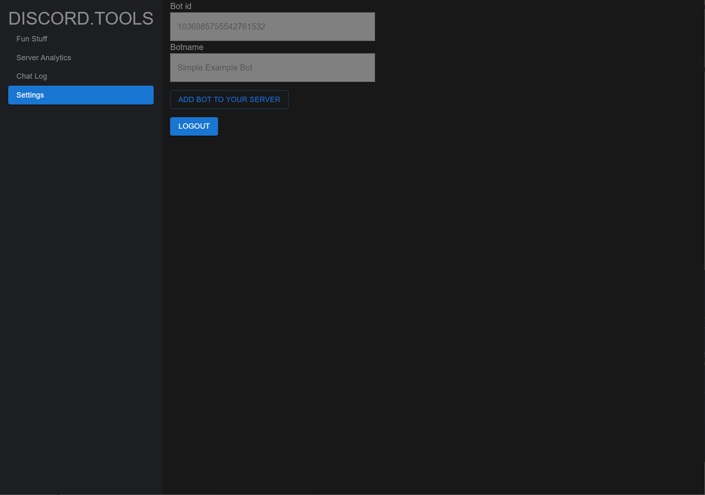

# Discord.Tools

This is the React App for the Discord.Tools 
The Discord.Tools allows users to get better use of their discord bots, such as send message as the bot, create polls or get a clear view of channels and servers that host the bot.
The Rails backend part can be found [here](https://github.com/ceahs/discord-panel)

## Libraries used
- Material UI to style the app
- React router for routing and navigation between app components
- Jest for unit testing
- Cookie to store user token
- Lodash for manipulation of bot message
- Axios to connect API from backend

## Functionality
### Login Page

The login page has a simple design that asks user to enter their bot token to continue. There's a link to create bot token instructions under the token field. The link to the github repo is in the top right corner.
For the demo of this app, user can login with token "hello123".

The mainpage has navigation bar on the left that can easily direct users to main features of the app. 

In the Fun Stuff page, users can ask their bots to send message to a particular channel with channel ID, or create a poll in a channel (this feature is still under construction).

In the Server Analytics page it shows the number of server the bot joined and the number of server that the bot has left.

The chatlog page lists the message bot sent to each channel. Each message is displayed with the channel ID and the time it's sent.

The setting page currently shows the Bot id and the server id. It also provides the logout button.