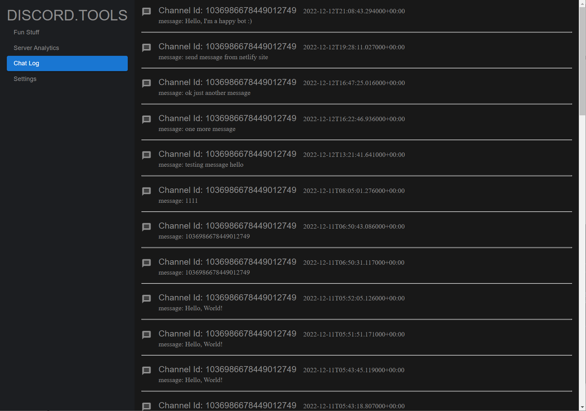

# Discord.Tools

This is the React App for the Discord.Tools 
The Discord.Tools allows users to get better use of their discord bots, such as send message as the bot, create polls or get a clear view of channels and servers that host the bot.

The deployed netlify site can be found [here](https://kaiqi-discord-panel.netlify.app/)

To use the app, download this [repo](https://github.com/Jimmyboei/discord-panel-backend) and run the server in the localhost.

## Libraries used
- Material UI to style the app
- React router for routing and navigation between app components
- Jest for unit testing
- Cookie to store user token
- Lodash for manipulation of bot message
- Axios to connect API from backend

## Functionality
### Login Page

The login page has a simple design that asks user to enter their bot token to continue. There's a link to create bot token instructions under the token field. The link to the github repo is in the top right corner.

The mainpage has navigation bar on the left that can easily direct users to main features of the app. For newly created bot, go to the setting page to add the bot to users' discord servers.

In the Fun Stuff page, users can ask their bots to send message to a particular channel with channel ID. 

The channel ID can be easily found in the discord. Simply open discord and go to the desired channel then look up the URL. It will be in the format of "https://discord.com/channels/XXXXX/YYYYY". The XXXXX is the server ID and the YYYYY is the channel ID.

The create a poll feature is still under construction.

The Server Analytics page currently shows the total number of servers the bot joined and the number of server that the bot has left.

The chatlog page lists the message bot sent to each channel. Each message is displayed with the channel ID and the time it's sent. Messages are displayed in the group of server then channel and followed the order of new to old from top to bottom.

The setting page shows the Bot id and Bot name. The bot id can be used to join users' discord server. There is also button to direct users to bot invitation link. It also provides the logout button.